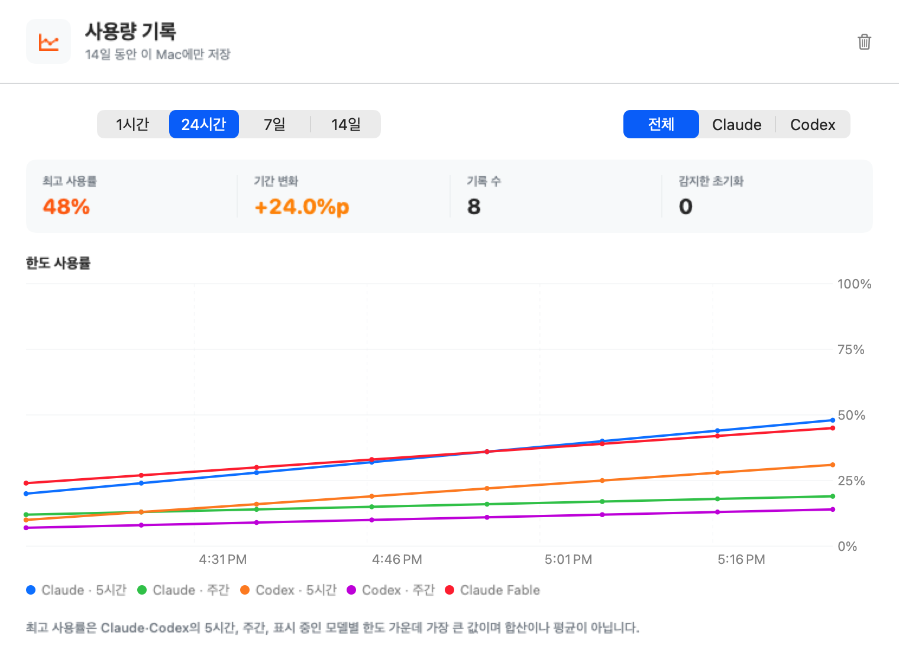
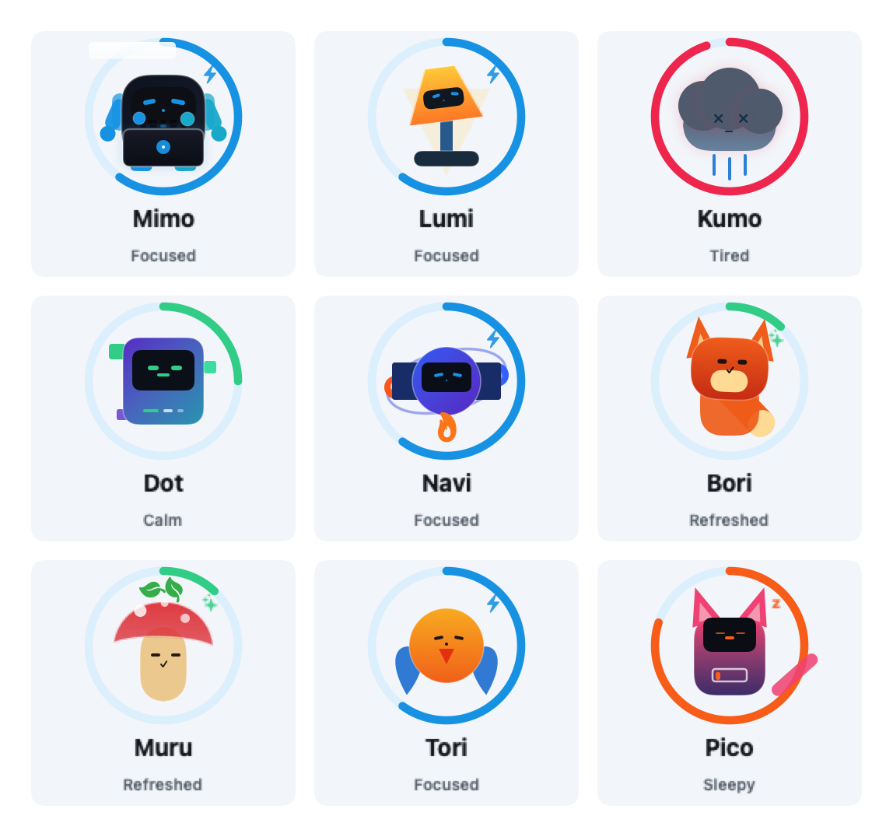
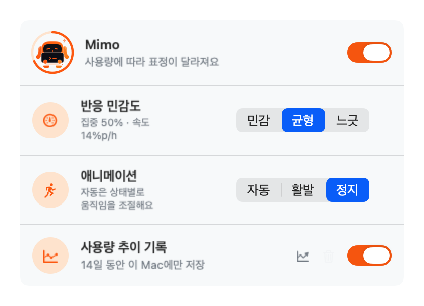

<div align="right">
  <a href="README.md">🇰🇷 한국어</a> · <b>🇺🇸 English</b>
</div>

# Claude + Codex Usage

<p align="center">
  
</p>

<p align="center">
  <b>See Claude and Codex usage at a glance — macOS menu bar + floating widget</b>
</p>

<p align="center">
  
  
  
  
</p>

<p align="center">
  <b>👉 <a href="https://jaewoo4200.github.io/ClaudeUsage/">Website</a> · <a href="https://github.com/jaewoo4200/ClaudeUsage/releases/download/v1.5.0/ClaudeUsage-1.5.0.dmg">Download v1.5.0</a> · <a href="#-read-before-first-launch">First-launch guide</a></b>
</p>

---

## ✨ What is Claude Usage?

A native macOS app that shows **Claude and ChatGPT/Codex usage** in real time through a menu bar item and a floating widget. It combines Claude's 5-hour, weekly, and model limits with OpenAI's 5-hour, weekly, and server-provided model-specific limits.

- 🤖 **Claude + Codex**: Fetches both providers independently and presents them together
- 🪟 **4 widget layouts**: Choose stacked, wide, arrow-switched pages, or independent Claude/Codex widgets
- 🧭 **Future model support**: Displays server-provided model limits without hardcoded names; GPT-5.3-Codex-Spark is hidden by default and optional
- 🧡 **Nine selectable companions**: Pick Mimo, Lumi, Kumo, Dot, Navi, Bori, Muru, Tori, or Pico and adjust sensitivity and animation
- 📈 **Local usage charts**: Optionally keep five-minute samples on this Mac for 14 days and inspect them by time range and provider
- 🪶 **Adaptive native animation**: Uses a low update cadence while calm and stops rendering when the floating widget is hidden
- 🎨 **3 themes**: Daangn / Toss / Hybrid — switch live
- 🌏 **Multilingual**: Korean / English — toggle instantly
- 🔄 **Auto-refresh every 60s** plus manual refresh
- 🌑 **Dark mode** — follows system appearance
- 💻 **Universal Binary** (Intel + Apple Silicon)

## 📸 Screenshots

### Menu bar label

<p align="center">
  
</p>

> The menu bar shows the Claude icon and percentage alongside the Codex icon and percentage. Each provider refreshes independently.

### Dropdown (3 themes)

<table>
  <tr>
    <td align="center"><b>🥕 Daangn</b></td>
    <td align="center"><b>💙 Toss</b></td>
    <td align="center"><b>✨ Hybrid</b></td>
  </tr>
  <tr>
    <td></td>
    <td></td>
    <td></td>
  </tr>
</table>

### Floating widget (3 themes)

<table>
  <tr>
    <td align="center"><b>🥕 Daangn</b></td>
    <td align="center"><b>💙 Toss</b></td>
    <td align="center"><b>✨ Hybrid</b></td>
  </tr>
  <tr>
    <td></td>
    <td></td>
    <td></td>
  </tr>
</table>

### Multilingual — Korean / English

<table>
  <tr>
    <td align="center"><b>🇰🇷 Korean</b></td>
    <td align="center"><b>🇺🇸 English</b></td>
  </tr>
  <tr>
    <td></td>
    <td></td>
  </tr>
  <tr>
    <td></td>
    <td></td>
  </tr>
</table>

### Settings

<table>
  <tr>
    <td align="center"><b>🇰🇷 Korean</b></td>
    <td align="center"><b>🇺🇸 English</b></td>
  </tr>
  <tr>
    <td></td>
    <td></td>
  </tr>
</table>

> Layout / separate providers / Spark visibility / theme / companion / local history / language all update live across the app.

### Local usage charts

<p align="center">
  
</p>

> Open the chart from the menu-bar graph icon or **Open usage charts** in Settings, then switch between 1 hour, 24 hours, 7 days, or 14 days and All, Claude, or Codex.

### Nine companions

<p align="center">
  
</p>

> All nine companions share the same usage and pace signals, but express them through different poses and props: light, weather, pixels, orbits, a tail, sprouts, wings, or a battery. See the [companion catalog](docs/COMPANION_CATALOG.md) for the full behavior map.

<p align="center">
  
</p>

## 🚀 Installation (Users)

1. Download [ClaudeUsage-1.5.0.dmg](https://github.com/jaewoo4200/ClaudeUsage/releases/download/v1.5.0/ClaudeUsage-1.5.0.dmg) ([all releases](https://github.com/jaewoo4200/ClaudeUsage/releases))
2. Open the dmg → drag to `Applications`
3. Before launching, please read ⬇️ [**Read before first launch**](#-read-before-first-launch)!

> **Requirement for Codex usage:** ChatGPT/Codex or a compatible Codex executable must be installed, with a valid signed-in Codex session. **The GUI app does not need to stay open.** ClaudeUsage starts a local `codex app-server` process whenever it refreshes.

## 🔑 Read before first launch

This app is **not signed with an Apple Developer ID** (free open-source — didn't pay the $99/year fee). macOS may show two security dialogs as a result. **Both are normal and safe.**

### 1) Bypass "unidentified developer"

Depending on your macOS version:

#### macOS Sonoma (14) or later — recommended

1. Double-click `ClaudeUsage.app` → if you see **"is damaged and can't be opened"**, click **Cancel**
2. Open **System Settings → Privacy & Security**
3. Scroll down → next to **"ClaudeUsage was blocked from use"** click **"Open Anyway"**
4. Confirm the next dialog → **"Open"**

#### macOS Ventura (13) — right-click

1. In Applications, **right-click (Control+click) `ClaudeUsage.app` → "Open"**
2. Confirm dialog → **"Open"** (once only — subsequent launches work normally)

#### Terminal one-liner (works on any version, fastest)

```bash
xattr -dr com.apple.quarantine /Applications/ClaudeUsage.app
```

Removes the macOS quarantine flag (auto-added to downloaded files). After this, normal double-click works.

### 2) Sign in & first fetch

- Click **[C] Sign in** in the menu bar → log in to claude.ai (Google supported)
- OpenAI usage connects automatically when Codex or a ChatGPT app with Codex integration is installed and signed in. Its GUI can remain closed.
- Once connected, each provider updates independently ✨

## 🔒 Is it safe? Keychain explained

Right after signing in, macOS may show this dialog:

> **"ClaudeUsage wants to access key 'app.claudeusage' in your keychain."**
> *"To allow this, enter the 'login' keychain password."*

### What is this?

When you first sign in, ClaudeUsage saves your **claude.ai session cookies in the macOS Keychain** so you don't have to re-login every time. macOS asks for permission when an **unsigned app accesses Keychain for the first time** — this is standard behavior.

### Why is it safe?

- 🔓 **Open source**: [The entire code is on GitHub](https://github.com/jaewoo4200/ClaudeUsage/tree/main/Sources/ClaudeUsage). Keychain code lives in [CookieStore.swift](https://github.com/jaewoo4200/ClaudeUsage/blob/main/Sources/ClaudeUsage/Services/CookieStore.swift) — about 28 lines.
- 🍪 **Your cookies, your Mac only**: claude.ai cookies are stored only in your local Keychain (no iCloud backup — `AfterFirstUnlockThisDeviceOnly` is set).
- 🌐 **No external transmission**: Cookies are used **only** for `claude.ai` API calls. No analytics, telemetry, or third-party servers.
- 🔐 **We don't see your password**: You log in on claude.ai's official page directly — the app never displays a password form itself.

### How is the OpenAI session handled?

- ClaudeUsage uses the local `codex app-server` interface from an installed ChatGPT/Codex app or compatible Codex executable. It starts that process itself when refreshing, so the ChatGPT/Codex GUI does not need to stay open. It does not read the OpenAI token file directly or store a copy.
- It calls only `account/rateLimits/read` and `account/usage/read`. No additional login window or token copy is required.
- If Codex/ChatGPT is unavailable or its session expires, Claude remains available and only the OpenAI section shows a connection prompt.

### Where does each usage number actually come from?

`Local interface` does not mean reading local conversation logs. ClaudeUsage asks a Codex process running on this Mac, and that process returns server-backed snapshots for the signed-in ChatGPT account.

| Displayed value | Data source | Reads conversation logs directly |
|---|---|---|
| Claude 5-hour, weekly, and model limits | claude.ai usage request authenticated with the user's Keychain session | No |
| Claude Code daily tokens and trend | Timestamp and numeric usage fields from `~/.claude/projects/**/*.jsonl` on this Mac | Yes, only local Claude Code records |
| Codex 5-hour, weekly, and model limits | `account/rateLimits/read` through the `codex app-server` bundled with ChatGPT/Codex | No |
| Codex daily tokens and trend | Account-level daily buckets returned by `account/usage/read` | No |
| Companion 14-day history | Opt-in `usage-history.json` written by ClaudeUsage | ClaudeUsage's own file |

ClaudeUsage does not scan regular ChatGPT conversations, ChatGPT Classic history, or Codex session content. It uses the current ChatGPT app with Codex integration, a standalone Codex app, or a compatible signed-in Codex executable.

### What does companion history store?

- History is **off by default** and starts only after the user enables it in Settings.
- Percentages, model-limit names and identifiers, daily token totals, and timestamps are kept for up to 14 days at `~/Library/Application Support/ClaudeUsage/usage-history.json`.
- Starting with v1.4.0, model-specific limit identifiers, display names, and percentages are retained so Fable and future server-provided limits remain separate in charts.
- Prompts, responses, filenames, project names, cookies, and access tokens are not stored. All history can be deleted immediately in Settings.
- Removing or reinstalling the app bundle does not automatically remove this history file. **Clear usage history** deletes only ClaudeUsage's 14-day trend samples; today's token total can appear again because it is recalculated from Claude Code's local logs and Codex account daily buckets.
- See [Usage history, privacy, and provider policy](docs/USAGE_HISTORY_AND_POLICY.md) for data-source and terms details.

### How companions calculate peak pressure

The selected companion's `peak pressure` is **one highest percentage**, not a sum or average:

```text
max(Claude 5-hour, Claude weekly, Claude model limits,
    Codex 5-hour, Codex weekly, visible Codex model limits)
```

When Spark visibility is off, Spark-specific limits are excluded from the calculation. With history enabled, the selected companion also considers the last hour's rate of change.

| Sensitivity | Focused starts | Sleepy starts | Tired starts |
|---|---:|---:|---:|
| Early | 35% or 8%p/h | 70% or 22%p/h | 90% or 40%p/h |
| Balanced (default) | 50% or 14%p/h | 75% or 28%p/h | 90% or 45%p/h |
| Relaxed | 60% or 18%p/h | 82% or 34%p/h | 94% or 52%p/h |

A drop of at least 15 percentage points followed by pressure below 60% produces the Refreshed state for up to 30 minutes. In Auto animation mode, target poses update about every 1.4 seconds while calm and every 0.45 seconds while Focused or Refreshed, with only 0.16 to 0.25 seconds of smooth transition depending on state. Lively uses 0.25-second updates; Still performs no continuous rendering.

> **Performance note:** On 2026-07-10, a 12-second horizontal-widget render-path sample on this Mac measured the installed v1.3.2 at about 31% average and 46.4% peak CPU. The v1.4.0 Release UI harness measured 1.5% average and 3.6% peak in Auto/Calm. The latter disabled account synchronization to isolate UI cost, so real usage varies with refresh activity and hardware.

### What should you do?

When the dialog appears:

- ✅ **"Always Allow"** (recommended) — Enter your Mac login password once → never asked again
- ⚠️ **"Allow"** — One-time only → asks again on next fetch
- ❌ **"Deny"** — Usage data won't load

> With code signing (Apple Developer ID, $99/year) this dialog wouldn't appear at all. Since this is a free open-source app, the dialog is part of macOS's standard process.

## 🪟 Windows 11 x64 alpha

Alongside the stable macOS release, `windows/` contains a **Windows 11 x64 developer alpha**. It is a .NET 10 WPF notification-area app that refreshes Claude and Codex independently and presents them in one flyout or floating widgets. It includes stacked, horizontal, paged, and separate layouts; three themes; Korean and English; nine companions; and optional 14-day local history.

> The Windows build is currently an **unsigned, self-contained ZIP**. The .NET runtime is bundled, but Claude sign-in requires the Microsoft Edge WebView2 Evergreen Runtime. Only Windows 11 x64 is in the tested release scope; there is no signed installer/MSIX or `win-arm64` release yet.

### Install the Windows alpha

1. If a Windows prerelease on [GitHub Releases](https://github.com/jaewoo4200/ClaudeUsage/releases) includes `ClaudeUsage-Windows-<version>-win-x64.zip` and its `.zip.sha256` file, download both. If no asset has been published yet, use the developer build below.
2. In PowerShell, compare `Get-FileHash .\ClaudeUsage-Windows-*-win-x64.zip -Algorithm SHA256` with the `.sha256` file.
3. Extract the entire ZIP to a folder and run `ClaudeUsage.Windows.exe`. Do not run it from inside the archive. SmartScreen may warn because this alpha is unsigned.
4. Codex must be signed in through the official app/CLI; run `codex login` if needed. Sign in to Claude from the app's **Claude sign-in** window.

### Windows data sources and privacy

| Value | Windows source | Local storage/access |
|---|---|---|
| Codex limits and today's tokens | Installed Codex `codex app-server` | Does not read `%USERPROFILE%\.codex\auth.json` or copy its token |
| Claude five-hour, weekly, and model limits | `claude.ai` through an isolated WebView2 sign-in session | Claude session cookie header encrypted for the current user with DPAPI at `%LOCALAPPDATA%\ClaudeUsage\claude-session.dat` |
| Local trends and companion state | Numeric usage samples, only after opt-in | `%LOCALAPPDATA%\ClaudeUsage\usage-history.json`, every five minutes, up to 14 days/4,200 samples |
| Today's Claude Code tokens | When history is enabled, timestamp and numeric usage fields from `%USERPROFILE%\.claude\projects\**\*.jsonl` | Does not retain prompts, responses, filenames, or project names |

The Claude sign-in profile is created per session under `%TEMP%\ClaudeUsage\WebView2\login-*` and cleanup is attempted when the window closes. General settings live at `%LOCALAPPDATA%\ClaudeUsage\settings.json`; the cookie is not written there. History and JSONL scanning are **off by default and enabled by the same explicit opt-in**.

Claude cloud usage depends on Anthropic's undocumented `claude.ai/api/organizations/.../usage` endpoint, which may change or be restricted without notice. Codex-only operation is isolated from that path.

### Build Windows from source

```powershell
dotnet restore windows/ClaudeUsage.Windows.sln --runtime win-x64 --configfile windows/NuGet.Config
dotnet test windows/ClaudeUsage.Windows.sln -c Release --no-restore
pwsh -File windows/scripts/package.ps1 -Runtime win-x64 -SkipRestore -SkipTests
```

The packaging script writes a self-contained ZIP and SHA-256 file under `windows/artifacts/`. See the [Windows README](windows/README.md) for full run, diagnostic, and privacy details, or the [Windows port handoff](HANDOFF.md) for the original design context.

## 🔧 Build (Developers)

### Prerequisites

```bash
# Xcode 15+ and Command Line Tools
sudo xcode-select -s /Applications/Xcode.app/Contents/Developer

# xcodegen (generates .xcodeproj from project.yml)
brew install xcodegen
```

### Build

```bash
git clone https://github.com/jaewoo4200/ClaudeUsage.git
cd ClaudeUsage

# Generate Xcode project
xcodegen

# Open in Xcode, or build via CLI
open ClaudeUsage.xcodeproj
# or
xcodebuild -project ClaudeUsage.xcodeproj -scheme ClaudeUsage build
```

### Package as dmg (Universal Binary)

```bash
./scripts/build-dmg.sh
# → build/ClaudeUsage-1.5.0.dmg (supports Intel + Apple Silicon)
```

### Regenerate icon

```bash
# After editing icon.svg
./scripts/build-icon.sh
# → Sources/ClaudeUsage/Resources/AppIcon.icns
```

## 🏗️ Project Structure

```
ClaudeUsage/
├── project.yml                  # xcodegen definition (project file as code)
├── scripts/
│   ├── icon.svg                 # icon source
│   ├── build-icon.sh            # SVG → .icns
│   └── build-dmg.sh             # Release Universal + dmg
├── Sources/ClaudeUsage/
│   ├── ClaudeUsageApp.swift     # @main + AppDelegate
│   ├── Models/                  # Claude/OpenAI usage response and display models
│   ├── Services/                # auth, API, ViewModel, ThemeStore, AppSettings, LanguageStore, Localization
│   ├── Views/                   # menu bar, widget, settings + design system
│   └── Resources/               # Info.plist, entitlements, AppIcon.icns
└── docs/screenshots/            # README assets
```

## 🛠️ Tech Stack

- **SwiftUI** + AppKit (native macOS)
- **WKWebView** (claude.ai OAuth/Google sign-in → cookie capture)
- **Keychain Services** (secure session cookie storage)
- **Codex app-server JSON-RPC** (documented local usage interface)
- **Local Claude Code JSONL aggregation** (optional token trends; no content retained)
- **URLSession async/await** (usage API calls)
- **NSPanel** (.statusBar level for the widget window)
- **xcodegen** (project file managed as code)

## ⚠️ Known Limitations

| Item | Detail |
|---|---|
| Unofficial API | `claude.ai/api/organizations/.../usage` is undocumented. May break if Anthropic changes it |
| Session expiry | When claude.ai cookies expire, you'll need to sign in again (the app shows a prompt) |
| OpenAI connection | Requires Codex/ChatGPT or a compatible executable with `codex app-server` and a signed-in local session; the GUI may remain closed |
| Token trends | OpenAI daily buckets may lag behind an active task. Claude uses only today's Claude Code logs on this Mac; neither maps 1:1 to quota percentages |
| Single account | One account per provider at a time |
| Code signing | Not signed with Apple Developer ID — first run needs right-click → Open |

## 🗺️ Roadmap

- [x] 🌑 **Dark mode** — added in v1.1.0
- [x] 🤖 **Codex / OpenAI usage** — added in v1.2.0
- [x] 🧡 **Mimo companion + 14-day local trends + 4 widget layouts** — added in v1.3.0
- [x] 📊 **Usage charts + Mimo sensitivity, animation, and performance improvements** — added in v1.4.0
- [x] 🎭 **Nine selectable companions with character-specific state actions** — added in v1.5.0
- [ ] 🔔 macOS notifications at 70% / 90%
- [ ] 📊 90-day+ statistics and data export
- [ ] 👥 Multiple organization accounts
- [ ] 🖥️ macOS Sonoma+ desktop widget (WidgetKit)

Contributions welcome — feel free to open issues or PRs.

## 📜 Disclaimer

This is an **independent open-source project, not affiliated with Anthropic or OpenAI**.

- It calls **undocumented internal APIs** of claude.ai. Behavior may break if these change.
- OpenAI usage now uses only the documented Codex `app-server` interface; the direct private `wham/usage` call has been removed.
- Anthropic's consumer terms restrict automated access without an API key or explicit permission. Review the [policy assessment](docs/USAGE_HISTORY_AND_POLICY.md) before public distribution.
- Use is at your own risk and must comply with Anthropic's [Consumer Terms](https://www.anthropic.com/legal/consumer-terms) and OpenAI's [Terms of Use](https://openai.com/policies/row-terms-of-use/).
- Only your own claude.ai cookies are stored in your local Keychain. No data is transmitted externally.
- "Claude" and related design elements are Anthropic's property. This is a fan-made utility app.

## 🙏 Inspiration / Credits

- Original **Claude Widget** by [ficklestudio26](https://ficklestudio26.blogspot.com/2026/05/mac.html) — referenced for the behavioral patterns of the Electron widget.
- UI inspiration: [Toss](https://toss.im/) / [Daangn](https://www.daangn.com/) — calm, friendly Korean fintech and community-app design languages.
- This project was built with extensive use of **[Claude](https://claude.ai)** and **[Claude Code](https://claude.com/claude-code)**. Analysis, design, SwiftUI code, debugging, icon SVG, localization, and even this README — every stage was assisted by Claude.

## 📄 License

MIT License — fork, modify, and use freely. You are responsible for complying with each service's terms.

---

<p align="center">
  Made with ☕ and Claude in Korea 🇰🇷
</p>
