<div align="right">
  <a href="README.md">🇰🇷 한국어</a> · <b>🇺🇸 English</b>
</div>

# Claude Usage

<p align="center">
  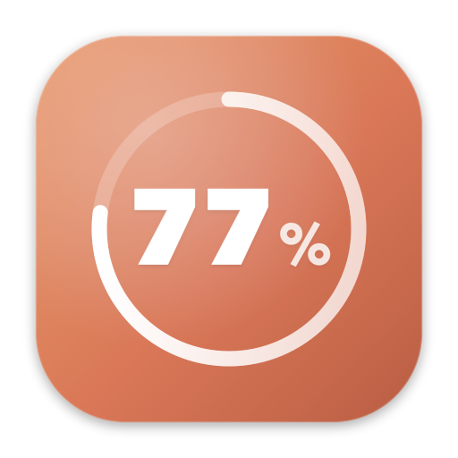
</p>

<p align="center">
  <b>See your Claude usage at a glance — macOS menu bar + floating widget</b>
</p>

<p align="center">
  
  
  
  
</p>

---

## ✨ What is Claude Usage?

A native macOS app that shows your **claude.ai usage** (5-hour / 7-day / Claude Design) in real time through a menu bar item and a floating widget.

- 🪶 **Lightweight**: 2MB dmg, 80MB RAM, < 0.1% CPU — no problem leaving it on all day
- 🎨 **3 themes**: Daangn / Toss / Hybrid — switch live
- 🌏 **Multilingual**: Korean / English — toggle instantly
- 🔄 **Auto-refresh every 60s** plus manual refresh
- 🌑 **Dark mode** — follows system appearance
- 💻 **Universal Binary** (Intel + Apple Silicon)

## 📸 Screenshots

### Menu bar label

<p align="center">
  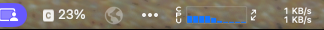
</p>

> The menu bar always shows your usage like `[C] 38%`. Above 70% it changes to ⚠️, above 90% to 🛑 — using shape rather than color (macOS forces menu-bar items to be monochrome).

### Dropdown (3 themes)

<table>
  <tr>
    <td align="center"><b>🥕 Daangn</b></td>
    <td align="center"><b>💙 Toss</b></td>
    <td align="center"><b>✨ Hybrid</b></td>
  </tr>
  <tr>
    <td>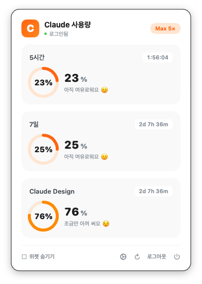</td>
    <td>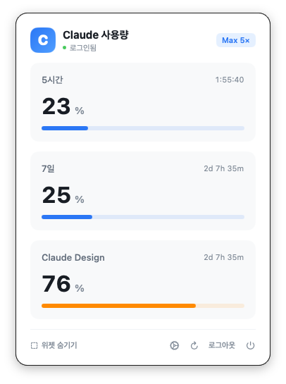</td>
    <td>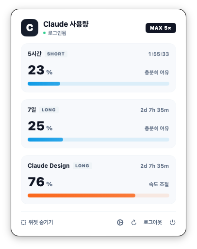</td>
  </tr>
</table>

### Floating widget (3 themes)

<table>
  <tr>
    <td align="center"><b>🥕 Daangn</b></td>
    <td align="center"><b>💙 Toss</b></td>
    <td align="center"><b>✨ Hybrid</b></td>
  </tr>
  <tr>
    <td>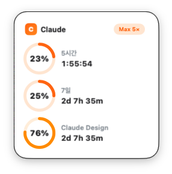</td>
    <td>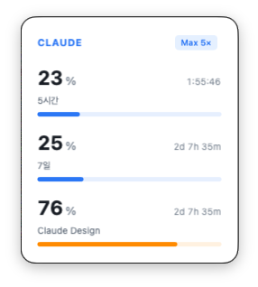</td>
    <td>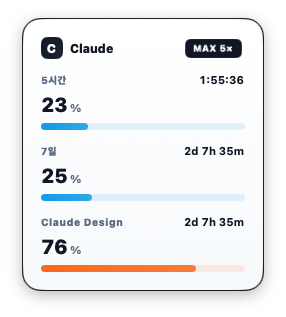</td>
  </tr>
</table>

### Multilingual — Korean / English

<table>
  <tr>
    <td align="center"><b>🇰🇷 Korean</b></td>
    <td align="center"><b>🇺🇸 English</b></td>
  </tr>
  <tr>
    <td></td>
    <td>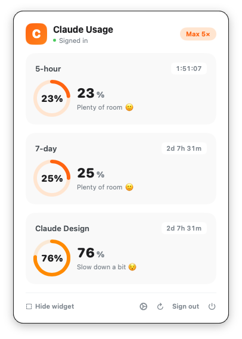</td>
  </tr>
  <tr>
    <td></td>
    <td>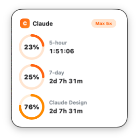</td>
  </tr>
</table>

### Settings

<table>
  <tr>
    <td align="center"><b>🇰🇷 Korean</b></td>
    <td align="center"><b>🇺🇸 English</b></td>
  </tr>
  <tr>
    <td>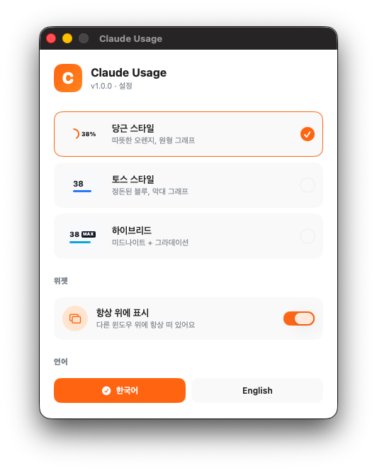</td>
    <td>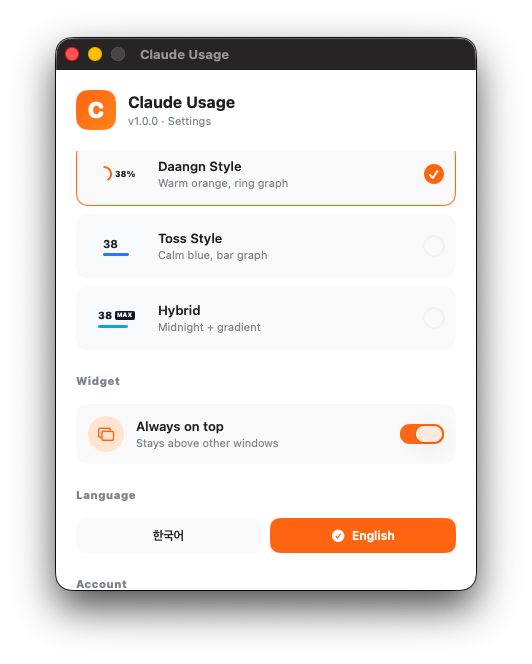</td>
  </tr>
</table>

> Theme / always-on-top / language — all toggle live and reflect instantly across menu bar, widget, and settings.

## 🚀 Installation (Users)

### 1. Download & install

1. Download the latest `ClaudeUsage-x.x.x.dmg` from [Releases](https://github.com/jaewoo4200/ClaudeUsage/releases)
2. Open the dmg → drag to `Applications`

### 2. ⚠️ First launch — bypassing "unidentified developer"

The app is not signed with an Apple Developer ID, so macOS blocks the first launch (a free open-source app doesn't justify the $99/year fee). **It's not malware and the bypass is safe.**

Depending on your macOS version:

#### macOS Sonoma (14) or later — recommended

1. Double-click `ClaudeUsage.app` → if you see **"is damaged and can't be opened"**, click **Cancel**
2. Open **System Settings → Privacy & Security**
3. Scroll down → next to **"ClaudeUsage was blocked from use"** click **"Open Anyway"**
4. Confirm the next dialog → **"Open"**

#### macOS Ventura (13) — right-click

1. In Applications, **right-click (Control+click) `ClaudeUsage.app` → "Open"**
2. Confirm dialog → **"Open"** (once only — subsequent launches work normally)

#### Terminal one-liner (works on any version, fastest)

```bash
xattr -dr com.apple.quarantine /Applications/ClaudeUsage.app
```

This removes the macOS quarantine flag (automatically added to downloaded files). After this, the app opens with a normal double-click.

### 3. Get started

- Click **[C] Sign in** in the menu bar → log in to claude.ai (Google supported)
- Once signed in, usage updates automatically ✨

## 🔧 Build (Developers)

### Prerequisites

```bash
# Xcode 15+ and Command Line Tools
sudo xcode-select -s /Applications/Xcode.app/Contents/Developer

# xcodegen (generates .xcodeproj from project.yml)
brew install xcodegen
```

### Build

```bash
git clone https://github.com/jaewoo4200/ClaudeUsage.git
cd ClaudeUsage

# Generate Xcode project
xcodegen

# Open in Xcode, or build via CLI
open ClaudeUsage.xcodeproj
# or
xcodebuild -project ClaudeUsage.xcodeproj -scheme ClaudeUsage build
```

### Package as dmg (Universal Binary)

```bash
./scripts/build-dmg.sh
# → build/ClaudeUsage-1.1.0.dmg (supports Intel + Apple Silicon)
```

### Regenerate icon

```bash
# After editing icon.svg
./scripts/build-icon.sh
# → Sources/ClaudeUsage/Resources/AppIcon.icns
```

## 🏗️ Project Structure

```
ClaudeUsage/
├── project.yml                  # xcodegen definition (project file as code)
├── scripts/
│   ├── icon.svg                 # icon source
│   ├── build-icon.sh            # SVG → .icns
│   └── build-dmg.sh             # Release Universal + dmg
├── Sources/ClaudeUsage/
│   ├── ClaudeUsageApp.swift     # @main + AppDelegate
│   ├── Models/                  # UsageData, Plan, ExtraUsage
│   ├── Services/                # auth, API, ViewModel, ThemeStore, AppSettings, LanguageStore, Localization
│   ├── Views/                   # menu bar, widget, settings + design system
│   └── Resources/               # Info.plist, entitlements, AppIcon.icns
└── docs/screenshots/            # README assets
```

## 🛠️ Tech Stack

- **SwiftUI** + AppKit (native macOS)
- **WKWebView** (claude.ai OAuth/Google sign-in → cookie capture)
- **Keychain Services** (secure session cookie storage)
- **URLSession async/await** (usage API calls)
- **NSPanel** (.statusBar level for the widget window)
- **xcodegen** (project file managed as code)

## ⚠️ Known Limitations

| Item | Detail |
|---|---|
| Unofficial API | `claude.ai/api/organizations/.../usage` is undocumented. May break if Anthropic changes it |
| Session expiry | When claude.ai cookies expire, you'll need to sign in again (the app shows a prompt) |
| Single account | Only one claude.ai account at a time |
| Code signing | Not signed with Apple Developer ID — first run needs right-click → Open |

## 🗺️ Roadmap

- [x] 🌑 **Dark mode** — added in v1.1.0
- [ ] 🤖 **GPT / OpenAI usage** support (multi-provider)
- [ ] 🔔 macOS notifications at 70% / 90%
- [ ] 📊 Usage history graph (local SQLite)
- [ ] 👥 Multiple organization accounts
- [ ] 🖥️ macOS Sonoma+ desktop widget (WidgetKit)

Contributions welcome — feel free to open issues or PRs.

## 📜 Disclaimer

This is an **independent open-source project, not affiliated with Anthropic**.

- It calls **undocumented internal APIs** of claude.ai. Behavior may break if these change.
- Use is at your own risk. Please comply with claude.ai's [Terms of Service](https://www.anthropic.com/legal/consumer-terms).
- Only your own claude.ai cookies are stored in your local Keychain. No data is transmitted externally.
- "Claude" and related design elements are Anthropic's property. This is a fan-made utility app.

## 🙏 Inspiration / Credits

- Original **Claude Widget** by [ficklestudio26](https://ficklestudio26.blogspot.com/2026/05/mac.html) — referenced for the behavioral patterns of the Electron widget.
- UI inspiration: [Toss](https://toss.im/) / [Daangn](https://www.daangn.com/) — calm, friendly Korean fintech and community-app design languages.
- This project was built with extensive use of **[Claude](https://claude.ai)** and **[Claude Code](https://claude.com/claude-code)**. Analysis, design, SwiftUI code, debugging, icon SVG, localization, and even this README — every stage was assisted by Claude.

## 📄 License

MIT License — fork, modify, and use freely. Just comply with Anthropic's ToS at your own risk.

---

<p align="center">
  Made with ☕ and Claude in Korea 🇰🇷
</p>
